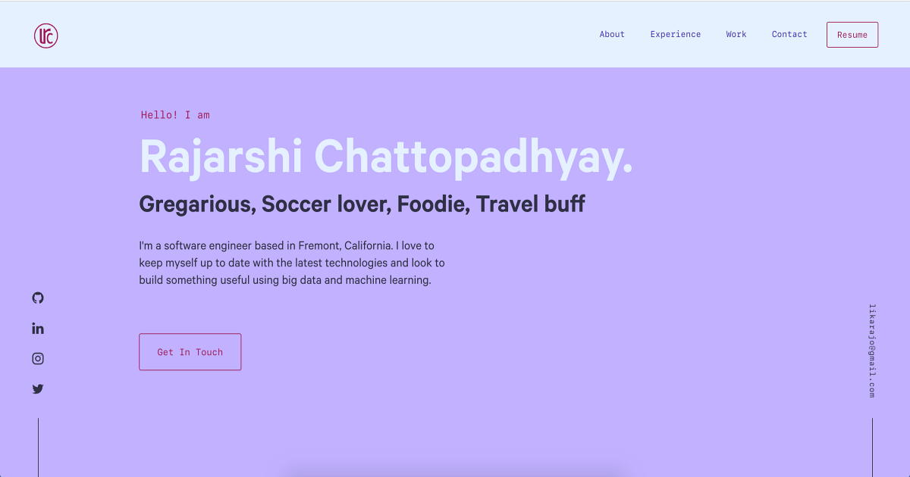

<div align="center">
  
</div>
<h1 align="center">
  <a href="https://likarajo.netlify.com" target="_blank">
    My Website
  </a>
</h1>
<p align="center">
  <a href="https://app.netlify.com/sites/likarajo/deploys" target="_blank">
    
  </a>
</p>

<p align="center">
  <a href="https://likarajo.netlify.com" target="_blank">
    
  </a>
</p>

<p align="center">
  Built with <a href="https://www.gatsbyjs.org/" target="_blank">Gatsby
  </a> and hosted with <a href="https://www.netlify.com/" target="_blank"> Netlify </a>
</p>

<hr>

<p align="center">
  Previous versions<br>
  <br>
  <a href="https://likarajo.github.io/website_v1" target="_blank">
    <i>v1</i>&nbsp;&raquo;&nbsp;
    
  </a>
  &nbsp; &nbsp;
  <a href="https://likarajo.github.io/website_v2" target="_blank">
    
    &nbsp;&laquo;&nbsp;
    <i>v2</i>
  </a>
</p>

<hr>

## Installation and Setup
1.  **Install [NVM](http://dev.topheman.com/install-nvm-with-homebrew-to-use-multiple-versions-of-node-and-iojs-easily/)**

2.  **Create *.nvmrc* file in the project directory**

    ```sh
    touch .nvmrc
    vi .nvmrc
    ```
    Specify the *Node.js* version in this file.<br>
    This is the project-specific version that will be installed using *nvm*. 
    
3.  **Install Node using NVM**

   ```sh
   nvm install
   ```
   
   This installs Node.js and NPM.

4.  **Install the Gatsby CLI using NPM**

   ```sh
   npm install -g gatsby-cli
   ```

5.  **Create a Gatsby site**

    Use the Gatsby CLI to create a new site, specifying the default starter.

    ```shell
    # create a new Gatsby site using the default starter
    gatsby new my-default-starter https://github.com/gatsbyjs/gatsby-starter-default
    ```

6.  **Start developing**

    Navigate into the new site’s directory and start it up

    ```shell
    cd my-default-starter/
    gatsby develop
    ```

7.  **Open the source code and start editing**

    The site runs at `http://localhost:8000`!

    **Note**: `http://localhost:8000/___graphql` is a tool to experiment with querying the data.<br>
    [graphiql Gatsby tutorial](https://www.gatsbyjs.org/tutorial/part-five/#introducing-graphiql)

    The `my-default-starter` directory can be opened and edited in the code editor. Saving the changes makes the browser update in real time!
    
8.  **Develop, Build, Serve**

    [Reference](https://www.gatsbyjs.org/tutorial/)

## Project directory structure

A quick look at the top-level files and directories you'll see in a Gatsby project.

    .
    ├── node_modules
    ├── src
    ├── .gitignore
    ├── .prettierrc
    ├── gatsby-browser.js
    ├── gatsby-config.js
    ├── gatsby-node.js
    ├── gatsby-ssr.js
    ├── LICENSE
    ├── package-lock.json
    ├── package.json
    └── README.md

1.  **`/node_modules`**: This directory contains all of the modules of code that your project depends on (npm packages) are automatically installed.

2.  **`/src`**: This directory will contain all of the code related to what you will see on the front-end of your site (what you see in the browser) such as your site header or a page template. `src` is a convention for “source code”.

3.  **`.gitignore`**: This file tells git which files it should not track / not maintain a version history for.

4.  **`.prettierrc`**: (Optional) This is a configuration file for [Prettier](https://prettier.io/). Prettier is a tool to help keep the formatting of your code consistent.

5.  **`gatsby-browser.js`**: This file is where Gatsby expects to find any usage of the [Gatsby browser APIs](https://www.gatsbyjs.org/docs/browser-apis/) (if any). These allow customization/extension of default Gatsby settings affecting the browser.

6.  **`gatsby-config.js`**: This is the main configuration file for a Gatsby site. This is where you can specify information about your site (metadata) like the site title and description, which Gatsby plugins you’d like to include, etc. (Check out the [config docs](https://www.gatsbyjs.org/docs/gatsby-config/) for more detail).

7.  **`gatsby-node.js`**: This file is where Gatsby expects to find any usage of the [Gatsby Node APIs](https://www.gatsbyjs.org/docs/node-apis/) (if any). These allow customization/extension of default Gatsby settings affecting pieces of the site build process.

8.  **`gatsby-ssr.js`**: This file is where Gatsby expects to find any usage of the [Gatsby server-side rendering APIs](https://www.gatsbyjs.org/docs/ssr-apis/) (if any). These allow customization of default Gatsby settings affecting server-side rendering.

9.  **`LICENSE`**: Gatsby is licensed under the MIT license.

10. **`package.json`**: A manifest file for Node.js projects, which includes things like metadata (the project’s name, author, etc). This manifest is how npm knows which packages to install for your project.

11. **`package-lock.json`**: This is an automatically generated file based on the exact versions of your npm dependencies that were installed for your project. **(You won’t change this file directly).**

12. **`README.md`**: A text file containing useful reference information about the project.

## Learning Gatsby

Full documentation for Gatsby lives [on the website](https://www.gatsbyjs.org/). Here are some places to start:

- **For most developers, we recommend starting with our [in-depth tutorial for creating a site with Gatsby](https://www.gatsbyjs.org/tutorial/).** It starts with zero assumptions about your level of ability and walks through every step of the process.

- **To dive straight into code samples, head [to our documentation](https://www.gatsbyjs.org/docs/).** In particular, check out the _Guides_, _API Reference_, and _Advanced Tutorials_ sections in the sidebar.

## Deployment

[](https://app.netlify.com/start/deploy?repository=https://github.com/gatsbyjs/gatsby-starter-default)
